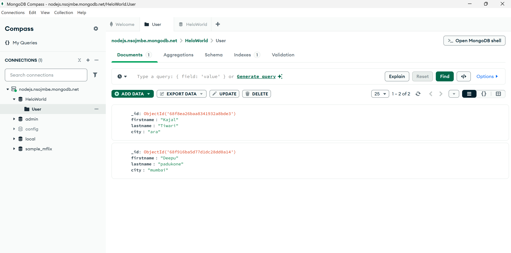

Steps to connect to db:
- Go to mongo db website 
- you have to create a free M0 cluster 
- create a user
- then you will get a connection string 
- Install mongodb compass

 # Mongodb compass -
 - It’s like a visual version of MongoDB, where you can do everything with clicks instead of terminal commands.

 
 🧩 Summary                  |        Mapping                  
Cluster	                     |     nodejs.nsojimbe.mongodb.net
Database	                   |     HeloWorld
Collection                   |     	User
Document	                   |     Each JSON record (like Kajal or Deepu)
Field	                       |      firstname, lastname, city
_id	Unique                   |        ObjectId created automatically
Compass Tool	               |      The GUI (software) showing everything visually
CRUD buttons	               |      Add, Update, Delete at the top
Schema/Indexes               |      Tabs	Used for structure and optimization

<!-- mongodb.github.io/node-mongodb-native/6.8/#md:find-all-documents -->